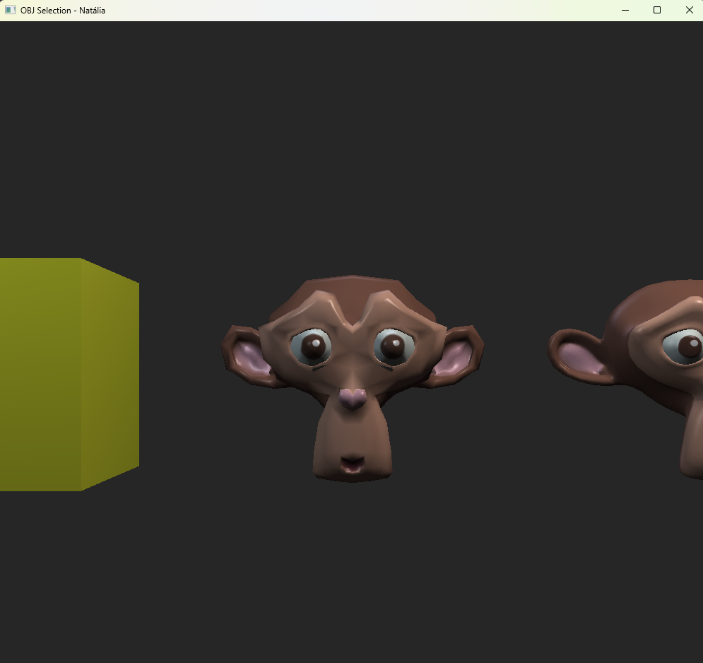

Estava enfrentando dificuldades em configurar a textura do chimpanzé nas atividades dos módulos 2, 3 e 4. Agora descobri que eu estava configurando a ordem do buffer de vértices diferente do que os ponteiros estavam esperando, por isso a textura estava distorcida. Agora alterei o arquivo [OBJSelection.cpp](../CGCCHibrido/src/OBJSelection.cpp) e o chimpanzé está com a textura configurada corretamente.

O resultado pode ser conferido na imagem abaixo.

