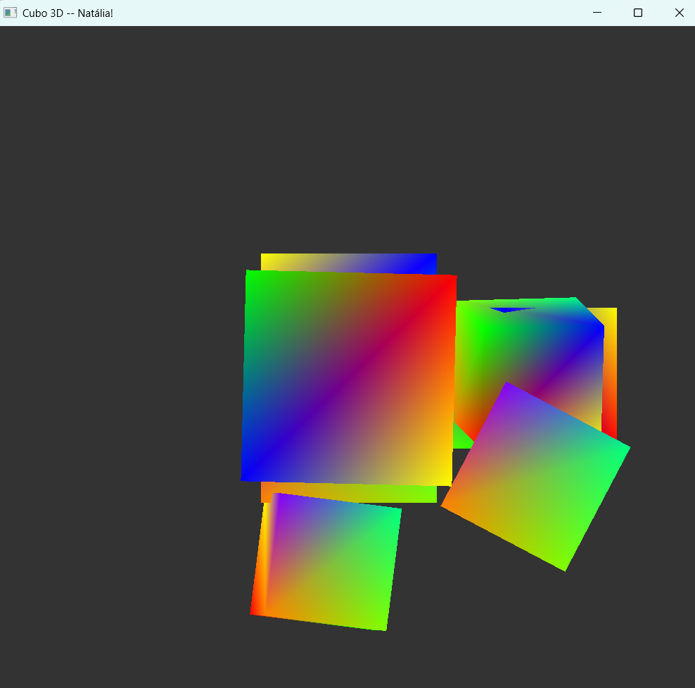

Para a Tarefa 2, criei o arquivo Hello3DCubo.cpp, além dos arquivos de configuração padrão (CMakeLists.txt, Makefile).

Além do que pedia no enunciado do desafio, organizei os cubos de forma que o usuário pode selecionar qual cubo deseja movimentar ou mudar a escala através dos dígitos de 1 a 6, já que 6 cubos foram instanciados.

O resultado pode ser conferido na imagem abaixo.

