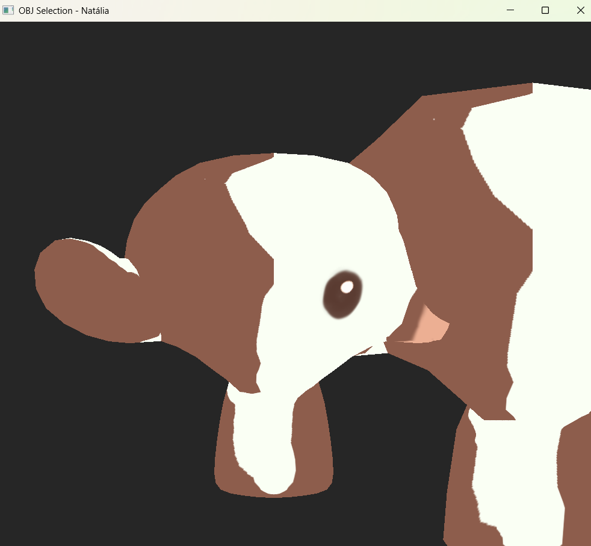

Para esta tarefa, alterei o arquivo que criei para a atividade vivencial [OBJSelection.cpp](../CGCCHibrido/src/OBJSelection.cpp), de forma que ele passasse a ler as coordenadas de texturas. Assim, as imagens que as possuem agora possuem uma aparência estilizada, conforme a imagem abaixo:

