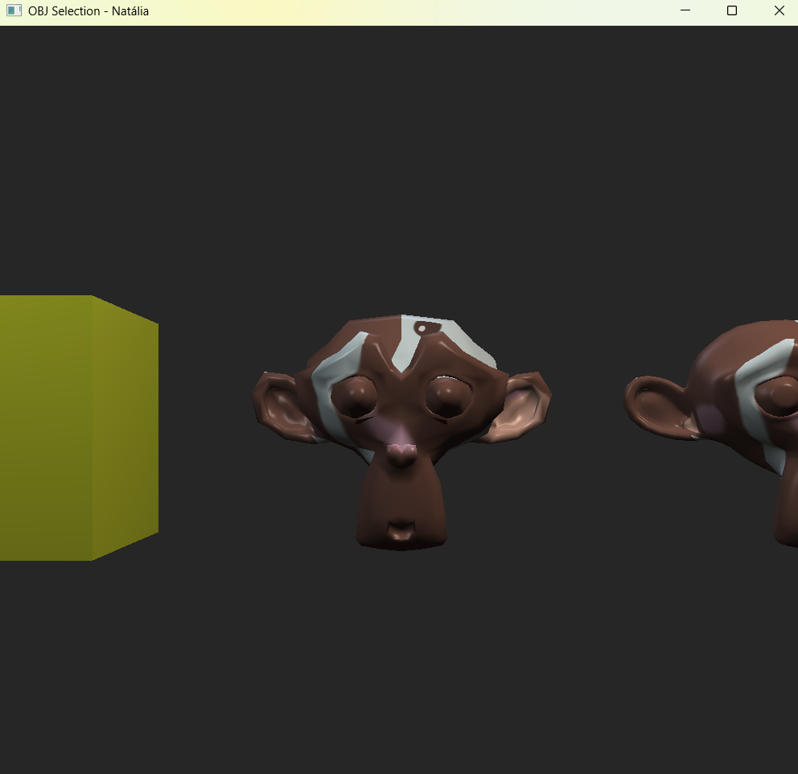
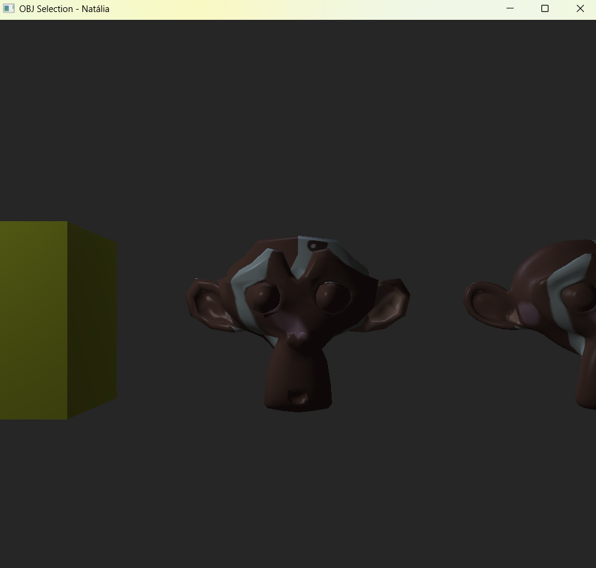
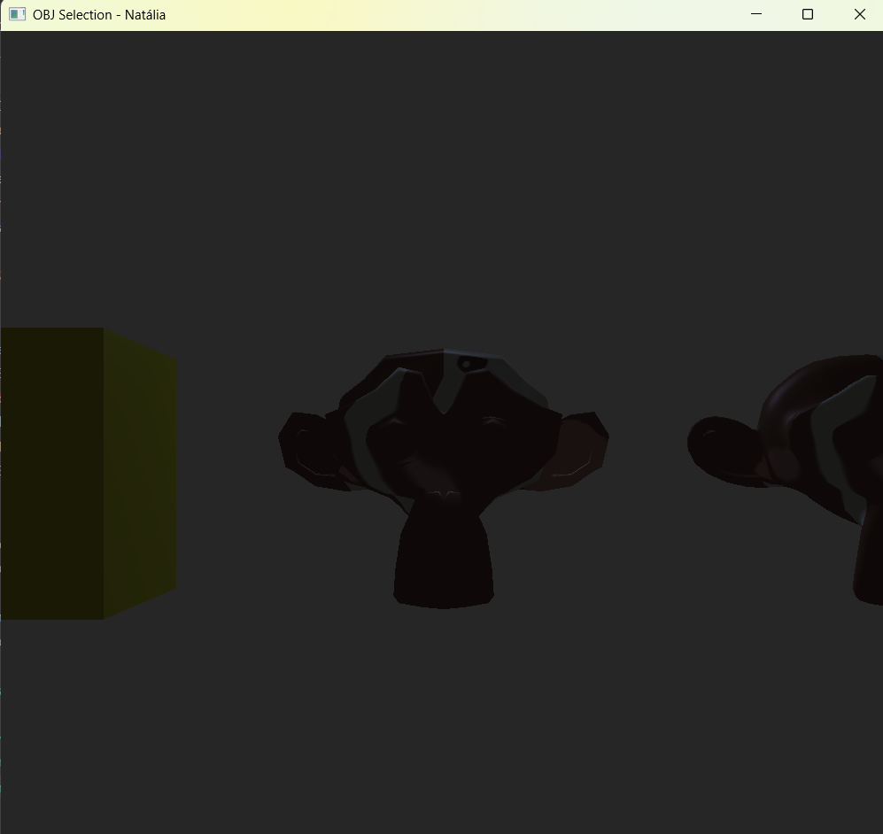
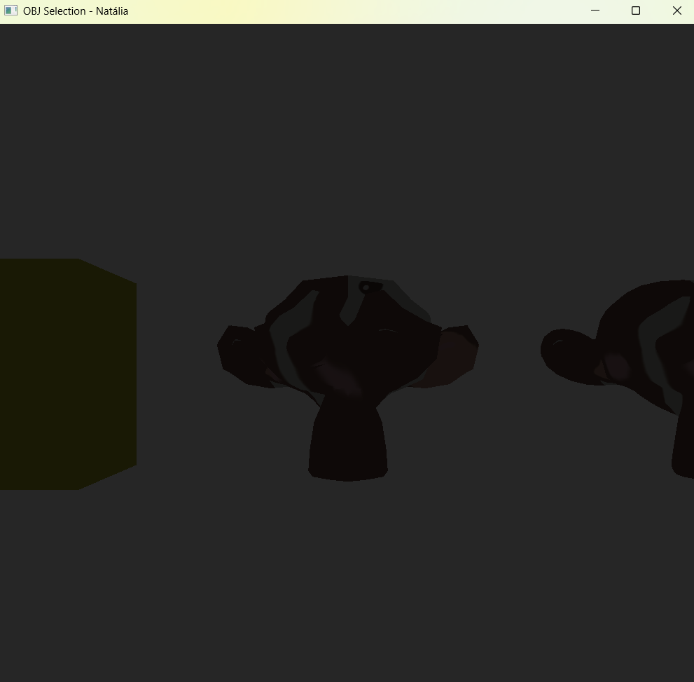
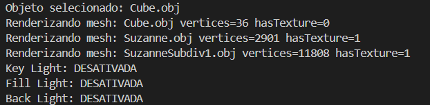

Para esta tarefa, alterei o arquivo que criei para a atividade vivencial [OBJSelection.cpp](../CGCCHibrido/src/OBJSelection.cpp), para habilitar os três tipos de iluminação (key light, fill light e back light). Elas podem ser habilitadas/desabilitadas com as teclas 1, 2 e 3, respectivamente.

Como default, as três iluminações ficam habilitadas, e na medida que elas são desabilitadas, em ordem (1, 2 e 3), elas aparecem conforme as imagens abaixo.

Todas as luzes habilitadas:

Key light desativada:

Fill light desativada:

Back light desativada:

Todas as funcionalidades anteriores estão habilitadas, e tudo é registrado nos logs:

Acredito que vale a implementação de um mecanismo que é possível selecionar o objeto e alterar a iluminação somente do mesmo, mas como todos os objetos estão no mesmo plano, ainda não imaginei como irei fazer isso.