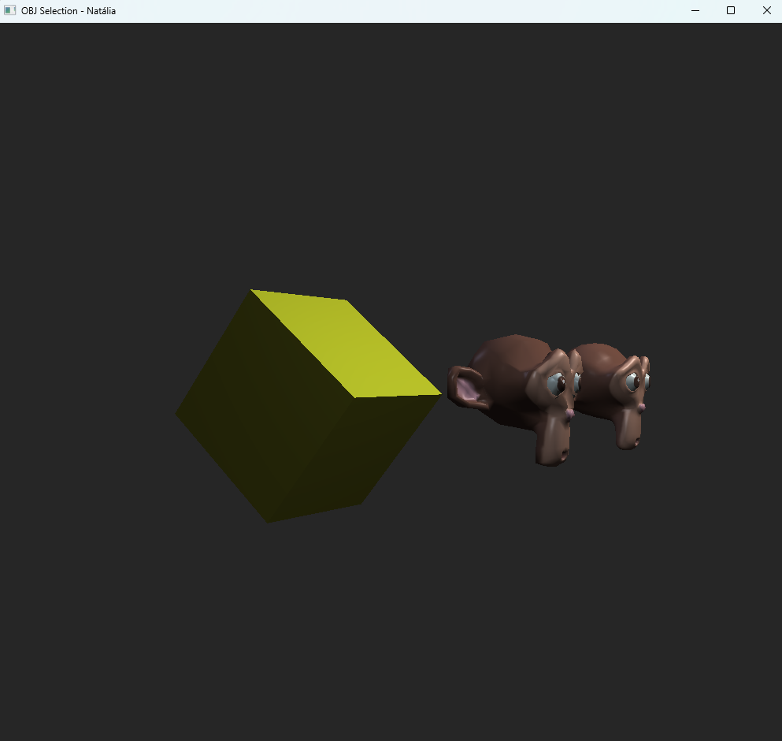

Para esta tarefa, alterei o arquivo  [OBJSelection.cpp](../CGCCHibrido/src/OBJSelection.cpp), para habilitar a câmera em primeira pessoa. O mouse já está habilitado para olhar ao redor e é possível alternar entre o comportamento já implementado nas atividades anteriores e girar a câmera com a tecla C. Quando girar a câmera estiver habilitado, é possível controlar utilizando as teclas WASD.

Câmera em primeira pessoa funcionando:

